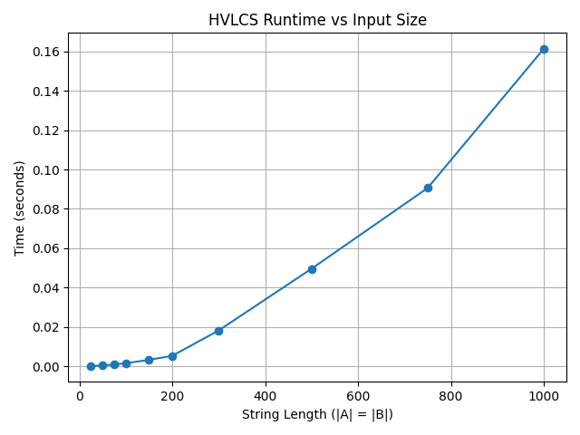

# COP4533_assignment3


# Programming Assignment 3 dynamic programming

Student: Ibrahim Zbib

UFID: 79090242


Repo Structure:
- README.md
- /data - input and output folder, graph for question 1
- /src - main program 

## How to run:
no compilation needed, since it is completely python3. To run the file with an input file:
```python3  src/solution.py <input_file> ```


### Run the program with an input file:
The /data folder holds the input and output files. /src folder holds the main program.
  ``` python3 src/solution.py data/example.in```
### Verify the outputs match:
``` python3 src/solution.py data/example.in | diff - data/example.out ```
no output in the terminal means that the output matches 

### Assumptions:
- Input matches the spec exactly
- all characters in the string appear in the alphabet, characters not in the alphabet get value 0
- The strings contain no empty spaces and are non-empty
- K is accurate
- There is no duplicate alphabet entries

# Question 1: empirical comparison
Ten input files were created with string lengths ranging from 25 to 1000, with |A| = |B| for each case. The alphabet used was 10 characters (a–j) with randomly assigned values. Runtime was measured by calling the solve function directly




The graph clearly shows quadratic run time (O(n^2)). 


# Question 2: recurrence equation
Let dp[i][j] be the maximum value of any common subsequence of the first i characters of A and the first j characters of B.
 #### Base cases:
``` dp[0][j] = 0   for all j >= 0```

```dp[i][0] = 0   for all i >= 0 ```

If either string has no characters, there is nothing to match, so the value is 0.

dp[i][j] =
        ```dp[i-1][j-1] + v(A[i]) ```        if A[i] == B[j], 
        ```max(dp[i-1][j], dp[i][j-1])```    otherwise

  #### Why this is correct:
   
Consider any common subsequence of A[1..i] and B[1..j]. Either the last characters A[i] and B[j] are both used in this subsequence, or at least one of them is skipped.

If A[i] ≠ B[j], they cannot both be the last element of any common subsequence. So the optimal solution either ignores A[i], giving the best result over A[1..i-1] and B[1..j], or ignores B[j], giving the best result over A[1..i] and B[1..j-1]. We take whichever is larger.

If A[i] == B[j], we have the option to include this character. Including it extends the best common subsequence of A[1..i-1] and B[1..j-1] by one character worth v(A[i]), giving dp[i-1][j-1] + v(A[i]). Since all character values are nonnegative, including a matching character never makes things worse — it can only keep the value the same or increase it. Therefore we always include a match, and the case reduces to dp[i-1][j-1] + v(A[i])

The final answer is dp[m][n] where m = |A| and n = |B|.


# Question 3: Pseudocode and runtime
HVLCS(A, B, v):

    m = length of A
    n = length of B

    // create a table of size (m+1) x (n+1), fill with 0s
    // dp[i][j] = best value we can get from A[1..i] and B[1..j]

    for i = 0 to m:
        for j = 0 to n:
            dp[i][j] = 0

    // fill in the table
    for i = 1 to m:
        for j = 1 to n:
            if A[i] == B[j]:
                dp[i][j] = dp[i-1][j-1] + v(A[i])
            else:
                dp[i][j] = max(dp[i-1][j], dp[i][j-1])

    // trace back through the table to rebuild the actual subsequence
    S = empty string
    i = m
    j = n
    while i > 0 and j > 0:
        if A[i] == B[j]:
            add A[i] to the front of S
            i = i - 1
            j = j - 1
        else if dp[i-1][j] >= dp[i][j-1]:
            i = i - 1
        else:
            j = j - 1

    return dp[m][n], S


The table initialization visits every cell once: O(mn). The fill loop runs exactly m × n iterations, each doing a single character comparison and at most two table lookups, which are all O(1) operations. The traceback starts at cell (m, n) and at each step either moves diagonally (i and j both decrease) or moves in one direction, so it visits at most m + n cells total, which is O(m + n). Character value lookup uses a dictionary so each lookup is O(1).

Overall: O(mn) + O(m + n) = O(mn) time. The space complexity is O(mn) for the DP table.
